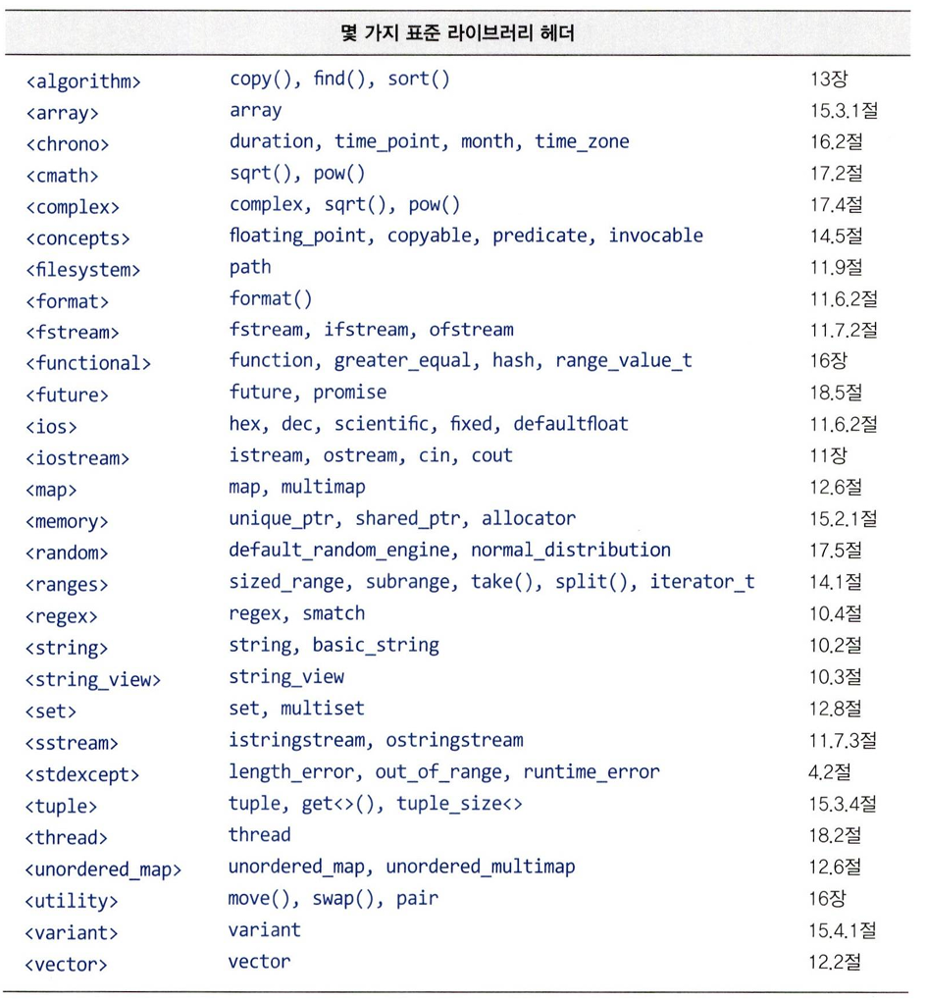

# 9장 : 라이브러리 훑어보기 - 작성자: 한지윤

# 9.1 소개

기초 프로그래밍 언어만으로는 쓸모 있는 프로그램을 만들 수 없다. 어떤 작업이든 좋은 라이브러리만 사용해도 대부분 간단히 완성할 수 있다. 

고심해서 직접 만들지 말고 표준 라이브러리를 먼저 이용하자. 9장에서는 표준 라이브러리 타입과 이러한 타입을 어떻게 이용하는지 설명한다. 

---

# 9.2 표준 라이브러리 컴포넌트

표준 라이브러리가 제공하는 기능은 다음과 같이 분류된다.

---

### 런타임 언어 지원

- 메모리 할당: `new` , `delete`
- 예외 처리: `try` , `catch`, `throw`
- RTTI(런타임 타입 정보)

---

### C 표준 라이브러리

- C언어 시절부터 쓰던 함수들을 C++에서도 그대로 쓸 수 있게 한다.
- 타입 시스템 위반을 최소화하기 위해 조금씩 수정되었다.
- `printf`, `strlen`, `char[]` 등

---

### 문자열 & 텍스트 처리

- `std::string` : char보다 안전한 문자열 타입, C++에서 권장됨
- `std::string_view` : 문자열을 복사하지 않고 일부분만 보고싶을 때 사용됨
    - `std::string`은 함수에 넘길 때마다 복사가 일어날 수있는데 `string_view`는 주소만 빌려주는 형식이라 훨씬 빠르다
    
    <aside>
    
    - `const string&` vs `string_view` 의 성능 차이
        - `const string&` : 이미 존재하는 string객체를 그대로 빌려오는 것
        - `string_view` : 어떤 문자열이든 포인터+길이만 뽑아서 가볍게 빌려오는 것
        
        비유하자면 참조로 가져오는건 도서관에서 실제 책한권을 빌려오는 것이고 `string_view`는 책의 특정 페이지 몇장을 사진찍어서 가져오는 것
        
        `const string&` 는 진짜 `std::string` 객체에 별명을 붙이는 것임.
        
        함수 내부에 `func(”hello”)`와 같은 문자열 리터럴이나 `char*`을 넘기면 컴파일러가 몰래 **임시 `string` 객체**를 새로 만들어서 거기에 참조를 연결함. 이 과정에서 문자열이 길면 **힙 메모리 할당**이 일어날 수 있음
        
        `string_view`는 실제 문자를 복사하지 않고, “시작 주소 + 길이” 딱 2개만 들고옴 (보통 16 Byte). 그래서 문자열이 뭐든간에 **메모리 할당 없이** 바로 담을 수 있음
        
        하지만, `string_view` 는 원본을 소유하지 않기 때문에 원본이 사라지면 유령 포인터 즉, 댕글링 포인터가 됨
        
    </aside>
    
- `std::regex` : “이 문자열은 이메일 형식인가?” 같은 패턴 매칭 검사
    
    ```cpp
     std::regex pattern(R"(\d{3}-\d{4})"); // 000-0000 형태 패턴
     std::cout << std::regex_match("123-4567", pattern) << '\n'; // 1(true)
    ```
    

---

### I/O 스트림 & 파일 시스템

- I/O 스트림
    - `std::cout`, `std::cin` 처럼 입출력을 “스트림(물 흐르듯이 이어지는 데이터)”로 다룬다.
    - 원하는 타입, 버퍼링 방식, 포맷팅까지 확장 가능
- `std::filesystem` : 윈도우/리눅스/맥에서 각각 다른 방식으로 파일 경로를 다뤄야 했는데, 이걸 통일된 방식으로 다룰 수 있게 해줌

---

### STL의 컨테이너, 알고리즘, 범위

데이터를 담는 그릇(컨테이너)과 그 그릇을 다루는 도구(알고리즘)의 조합 - C++의 심장부(클로드 왈…)

- **컨테이너**: `vector`(가변 배열), `map`(키-값 저장소)등 데이터 저장 방식
- **알고리즘**: `find()`, `sort()`, `merge()`등 컨테이너에 적용하는 연산
    
    → 이 둘을 합쳐서 **STL(Standard Template Library)**라고 부른다
    
- **범위(range)**:
    - 기존에는 시작 반복자, 끝 반복자 두개를 넘겨야했는데, 이제는 컨테이너 하나만 넘기면 됨
    - 뷰(데이터를 복사 없이 변형해서 보기), 제너레이터(필요할 때 마다 값을 하나씩 만들어 냄), 파이프(`|`로 연산을 이어붙이기)를 포함함
    - 뷰, 제너레이터, 파이프
        
        ### View
        
        - "v에서 짝수만 보는 뷰를 만들어.”
        
        ```cpp
        auto even = v | std::views::filter([](int x) // 
        {
            return x % 2 == 0;
        });
        ```
        
        ### Generator
        
        - 기존 방식
        
        ```cpp
        std::vector<int> v;
        
        for(int i=1;i<=1000000;i++)
            v.push_back(i);
        ```
        
        - Generator는?
        
        ```cpp
        필요해?
        
        ↓
        
        1 생성
        
        ↓
        
        다음 필요?
        
        ↓
        
        2 생성
        
        ↓
        
        다음 필요?
        
        ↓
        
        3 생성
        ```
        
        ### 파이프
        
        ```cpp
        auto result =
            v
            | std::views::filter([](int x)
            {
                return x % 2 == 0;
            })
            | std::views::transform([](int x)
            {
                return x * 10;
            });
        ```
        
        ```cpp
        원본
        
        1 2 3 4 5 6
        
        ↓
        
        짝수만
        
        2 4 6
        
        ↓
        
        10배
        
        20 40 60
        ```
        
- **콘셉트(concept):** “이 타입은 정렬 가능해야한다”같은 요구 조건을 이름 붙여 표현하는 것

---

### 수치 계산

수학 계산에 필요한 모든 것 - 삼각 함수, 복소수, 난수 등등

- 표준 수학 함수(`sprt`, `sin`), 복소수(`std::complex`), 벡터 산술 연산(`std::valarray`), 수학 상수(`std::number::pi`), 난수 생성기(`std::mt19937`) 등을 지원함

---

### 동시 실행(Concurrency) 프로그래밍

여러 작업을 동시에 처리하기 위한 도구 - 스레드, 락, 코루틴, 병렬 알고리즘

- `thread` **&** `lock` : 여러 작업을 동시에 실행(스레드)하고, 동시에 같은 데이터를 건드려서 생기는 충돌을 막는 장치(락)
- **코루틴**:
    - 함수를 실행하다가 중간에 **멈췄다가 나중에 이어서 실행**할 수 있는 기능
    - 동기식(순서대로 기다림), 비동기식(기다리지 않고 다른 일 함) 둘 다 지원
- **병렬 알고리즘:** `sort()`, `reduce()` 같은 알고리즘을 여러 CPU코어에 나눠서 동시에 처리

```cpp
#include <thread>
#include <iostream>
#include <mutex>

std::mutex m;  // 락(lock) 역할

void work(int id) {
    std::lock_guard<std::mutex> guard(m); // 다른 스레드가 동시에 못 들어오게 막음
    std::cout << "스레드 " << id << " 작업 중\n";
}

int main() {
    std::thread t1(work, 1);
    std::thread t2(work, 2);
    t1.join();  // 스레드가 끝날 때까지 기다림
    t2.join();
}
```

CPU가 코어를 여러 개 가진 시대에, "한 번에 하나씩" 처리하면 성능을 낭비하게 됩니다. 스레드는 **여러 코어를 동시에 활용**해서 속도를 높입니다.

락(`mutex`) 없이 여러 스레드가 같은 변수를 동시에 수정하면 **데이터 경쟁(race condition)**이 생겨서 프로그램이 예측 불가능하게 동작합니다. 초보자가 가장 많이 겪는 동시성 버그입니다

---

### 유틸리티 & 특수 목적 컨테이너

자원 관리, 타입 조합, 시간/날짜 처리 등 자잘하지만 꼭 필요한 도구 모음

- `unique_ptr` , `shared_ptr` : 메모리를 자동으로 해제해주는 스마트 포인터
- `pair` : 두 값을 하나로 묶기
    - `map` : 내부적으로 `pair`를 사용해서 만들어진 컨테이너
- `variant` , `optional` : "여러 타입 중 하나" 또는 "값이 있을 수도, 없을 수도" 표현
- `array` , `bitset` , `tuple` : 크기 고정 배열 / 비트 묶음 / 여러 타입 묶음
- `time_point` ,`system_clock` : 시각과 기간 표현
- `month` , `time_zone` : 달력, 시간대 계산
- 단위 접미사 `ms`, `i` : 숫자에 단위를 붙여 명확하게 표현
- 메타프로그래밍 : "타입에 대한 함수" — 컴파일 시점에 타입을 검사/변환

```cpp
#include <memory>
#include <optional>
#include <array>
#include <chrono>
#include <iostream>

std::optional<int> find_value(bool found) {
    if (found) return 42;
    return std::nullopt;       // 값이 없음을 명확히 표현
}

int main() {
    auto p = std::make_unique<int>(10);   // 스마트 포인터: 자동 메모리 해제
    std::array<int, 3> arr = {1, 2, 3};   // 크기 고정 배열

    if (auto v = find_value(true))
        std::cout << *v << '\n';          // 42

    using namespace std::chrono_literals;
    auto duration = 100ms;                // 단위 접미사: 100 밀리초
}
```

`unique_ptr`은 특히 중요한데, `delete`를 깜빡 잊어서 생기는 **메모리 누수** 버그를 원천 차단해줍니다. `optional`은 "값이 없을 수도 있음"을 `nullptr`이나 `-1` 같은 애매한 방법 대신 **명확하게** 표현합니다.

---

### view, string_view, span - 시퀀스 조작

데이터를 복사하지 않고 구간만 빌려서 보는 방법들

```cpp
#include <span>
#include <vector>
#include <iostream>

void print(std::span<int> s) {  // 배열이든 vector든 다 받을 수 있음(복사X)
    for (int x : s) std::cout << x << ' ';
}

int main() {
    std::vector<int> v = {1, 2, 3, 4, 5};
    print(std::span<int>(v).subspan(1, 3)); // 2 3 4 (일부만 빌려서 봄)
}
```

`span`, `string_view`, `view`는 모두 같은 철학을 공유합니다: **"소유하지 않고 빌려서 본다"**. 이렇게 하면 불필요한 복사가 없어 성능이 좋고, 함수 하나로 배열/벡터/문자열 등 다양한 자료구조를 받을 수 있어 코드가 유연해집니다

---

라이브러리 내 클래스로 포함시키는 주된 기준은 아래와 같다

- 대부분의 C++ 프로그래머에게 유용했다.
- 같은 기능을 제공하는 단순한 버전에 비해 오버헤드가 크지 않은 일반적인 형태로 제공할 수 있다
- 간단한 사용법을 쉽게 배울 수 있다

---

# 9.3 표준 라이브러리 구성

---

## 9.3.1 네임스페이스

표준 라이브러리의 모든 기능은 `namespace std` 안에 있고, `std::` 접두사(또는 `using` 선언)로 명시적으로 가져와야 한다.

이것은 여러 라이브러리를 함께 써도 이름이 충돌하지 않도록 격리하기 위한 장치다.

---

### 핵심 문법 정리

- `namespace std`
    - 표준 라이브러리 전체가 속한 네임스페이스
    - 예시: `std::string s;`
- `#include <header>`
    - 헤더 파일을 통해 표준 라이브러리 선언을 가져옴
- `import std;`
    - C++23 이상 사용 가능
    - 모듈로 표준 라이브러리 전체를 가져옴
- `using namespace std;`
    - std의 이름을 접두사 없이 쓸 수 있게 함
    - 예제 코드에서만 편의상 사용, 실무 헤더 파일에서는 지양해야 함
- `using std::string`
    - std의 특정 이름하나만 석택적으로 가져옴
- `std::chrono` , `std::literals` 등 하위 네임스페이스
    - 리터럴 접미사처럼 명시적으로 끌고와야 하는 기능
    - 리터럴 접미사
        
        ```cpp
        100L    // long
        100LL   // long long
        100U    // unsigned int
        100UL   // unsigned long
        100.0F  // float
        100.0L  // long double
        ```
        
        ```cpp
        float pi = 3.14F;
        
        double pi2 = 3.14;
        
        long double pi3 = 3.14L;
        ```
        
    - 예시: `using namespace std::literals::chrono_literals;`
    
    ```cpp
    // complex_literals를 가져오지 않은 상태
    auto z1 = 2+3i;   // 오류: 'i' 접미사를 모름
    
    using namespace std::literals::complex_literals;  // 명시적으로 가져옴
    auto z2 = 2+3i;    // OK: z2는 complex<double>
    ```
    

---

### 주의 사항

- 헤더파일에서 `using namespace std`를 사용하게 되면 이 헤더를 include하는 모든 파일이 오염된다.
    
    ```cpp
    // my_header.h
    using namespace std;   // 이 헤더를 include하는 모든 파일이 오염됨
    ```
    
- `.cpp` 파일 내부, 가능하면 좁은 스코프에서만 사용
    
    ```cpp
    void foo() {
        using namespace std;  // 이 함수 안에서만 영향
        string s = "hello";
    }
    ```
    

---

## 9.3.2 ranges 네임스페이스

표준 라이브러리 알고리즘은 “반복자 쌍” 버전(`sort(begin, end)`)과 “range 하나” 버전(`sort(v)`) 두 가지가 있는데, 둘은 완전히 오버로딩하면 모호성이 생기기 때문에 range 버전은 `range::` 네임스페이스로 따로 분리되어 있다.

---

### 예제

```cpp
using namespace std;
using namespace ranges;

void f(vector<int>& v)
{
    sort(v.begin(), v.end());   // 오류: 모호함 (std::sort와 ranges::sort 둘 다 매칭)
    sort(v);                    // 오류: 모호함
}
```

- 두 네임스페이스를 동시에 선언하였기 때문에, 컴파일러가 둘 다 후보로 보고 못 고른다.

```cpp
using namespace std;   // ranges는 열지 않음

void g(vector<int>& v)
{
    sort(v.begin(), v.end());      // OK: std::sort (반복자 버전)
    sort(v);                       // 오류: std 안엔 range 하나만 받는 sort가 없음
    ranges::sort(v);                // OK: 명시적으로 range 버전 지정
    using ranges::sort;              // 지금부터 sort(v)는 ranges::sort로 해석
    sort(v);                        // OK
}
```

- 스코프 내부에 using으로 선언하여 현재 sort가 무엇인지 명시함

---

## 9.3.3 모듈

표준 라이브러리 전체를 헤더 `#include` 없이 `import std` 한 줄로 가져올 수 있게 하려는 것이 모듈의 목표지만, C++ 20 표준화 당시에는 위원회의 시간 부족으로 완성되지 못했고 C++ 23에서 `module std` 로 보완되었다.

---

### 핵심 문법 정리

- `import std`
    - 표준 라이브러리 전체를 모듈로 가져옴
    - 헤더 include를 대신함
- `#include` vs`import`
    - 텍스트 삽입 방식  vs 컴파일된 인터페이스 재사용 방식

---

### 예제

```cpp
// 헤더 방식 (전통적)
#include <string>
#include <vector>
#include <iostream>

// 모듈 방식 (C++23~)
import std;
```

- 헤더 방식은 전처리기가 `#include` 지점에 파일 내용을 그대로 복붙한다.
- `.cpp` 파일마다 같은 헤더를 반복 파싱해야 해서 빌드가 느려짐
- 모듈 방식은 미리 컴파일된 바이너리 인터페이스를 재사용한다.

---

## 9.3.4 헤더



```cpp
#include <cstdlib>   // C 스타일 stdlib.h의 C++ 버전

int x = std::abs(-5);   // std:: 네임스페이스에도 들어있음
int y = abs(-5);         // 전역 네임스페이스에도 남아있는 경우가 많음 (구현체 의존)
```

- `<c헤더이름>` 스타일(`.h` 제거 + `c` 접두사)은 C 헤더를 C++스럽게 감싼 것으로, `std::`로도 쓸 수 있게 해준다.

---

# 참고

---

### Boost

C++ 표준 라이브러리에 아직 없는 기능을 제공하는 대표적인 서드파티 라이브러리 모음. 스마트 포인터, 정규식, 파일시스템처럼 지금은 당연히 `std::`에 있는 기능들도 원래 Boost에서 먼저 나와 검증받은 뒤 표준으로 채택된 경우가 많다.

- **라이선스**: Boost Software License(BSL) — 상업적 이용에도 매우 관대함
- 지난 25년간 40개 이상의 Boost 라이브러리가 C++ 표준에 채택됨 (`shared_ptr`, `filesystem`, `optional`, `variant`, `string_view` 등)
- 모든 플랫폼, 컴파일러, C++ 표준 버전에서 동작하도록 설계됨
- 최신 버전은 1.89.0으로, Asio·Beast 등 네트워킹/비동기 라이브러리 업데이트를 포함
    - 웹사이트: [https://www.boost.org](https://www.boost.org/)

---

### The C++ Alliance

C++ 언어의 발전을 돕는 것을 목표로 하는 비영리 조직으로, 오픈소스 라이브러리 생태계와 그에 기여하는 커뮤니티를 키우는 데 집중한다.

- Boost 라이브러리 모음 같은 동료 심사(peer-reviewed) 프로젝트에 자금과 인력을 지원
- 표준 위원회 멤버, 컴파일러/라이브러리 개발자들이 모이는, 가장 크고 활발한 C++ Slack 커뮤니티를 운영
- 2024년 말 Boost 커뮤니티의 공식 투표(Formal Review)를 통해 Boost 자산의 재정 후원 기관(Fiscal Sponsor)으로 C++ Alliance가 선정됨 — 즉 지금은 Boost 프로젝트를 재정적으로 지원하는 공식 조직
    - [https://cppalliance.org/alan/2025/10/28/Alan.html](https://cppalliance.org/alan/2025/10/28/Alan.html)

---

### 한 줄 정리

**"Boost는 표준 라이브러리의 실험실이고, C++ Alliance는 그 실험실을 재정적·조직적으로 뒷받침하는 후원 기관이다."**